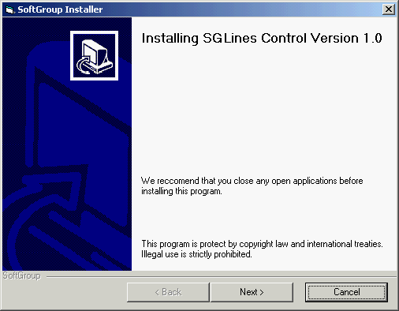



## Simple Lines Control

### Description

This is just a simple Active-X control that allows you to create those neat double lines! This is nothing really special and you could do the same thing with the lines in VB, but, I'm lazy! If you like the code please vote.
 
### More Info
 

             |
---                |---
**Submitted On**   |2002-06-14 23:14:26
**By**             |[Michael Crute](https://github.com/Planet-Source-Code/PSCIndex/blob/master/ByAuthor/michael-crute.md)
**Level**          |Beginner
**User Rating**    |4.3 (13 globes from 3 users)
**Compatibility**  |VB 5\.0, VB 6\.0
**Category**       |[OLE/ COM/ DCOM/ Active\-X](https://github.com/Planet-Source-Code/PSCIndex/blob/master/ByCategory/ole-com-dcom-active-x__1-29.md)
**World**          |[Visual Basic](https://github.com/Planet-Source-Code/PSCIndex/blob/master/ByWorld/visual-basic.md)
**Archive File**   |[Simple\_Lin946546142002\.zip](https://github.com/Planet-Source-Code/michael-crute-simple-lines-control__1-35863/archive/master.zip)

